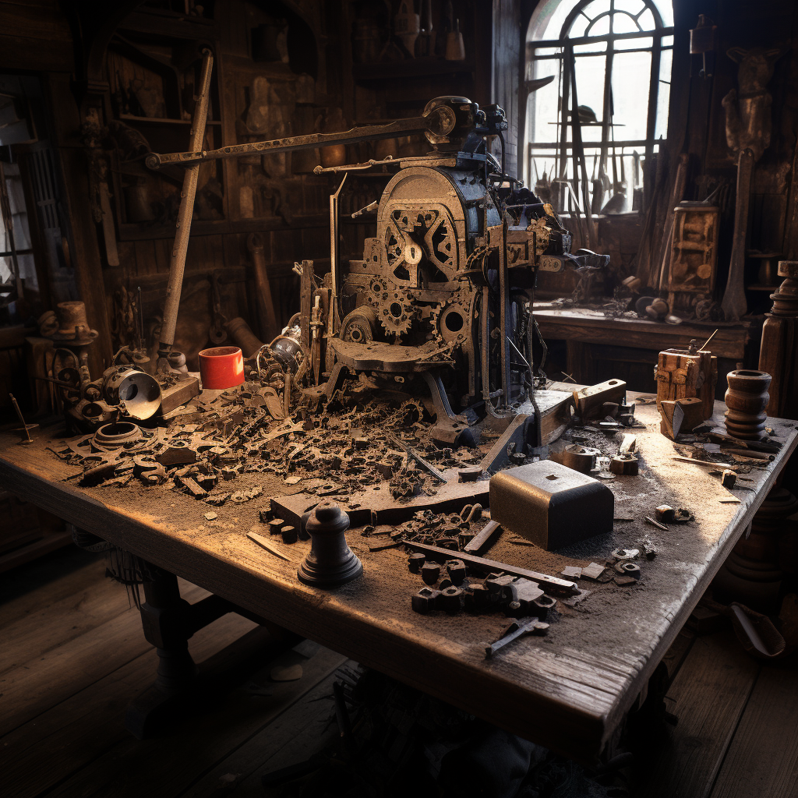

<h1>Clear Subalias</h1>

Subalias that allows players to clear their crafting progress (most of the time when they finish an item)

## Owner(s):
- Seth Hartman (ShadowsStride)

## Help:
`!craft clear`

If the pro-rate refund is turned on, the subalias will attempt to give a pro-rated refund based upon remaining progress. If the xp_categories is turned on, the subalias will add xp to xp tracker (recommended to use the [New XP](https://avrae.io/dashboard/workshop/618b77bd5c51fd18fe5356a0) library made by bryonius, otherwise it shows up in cvars).