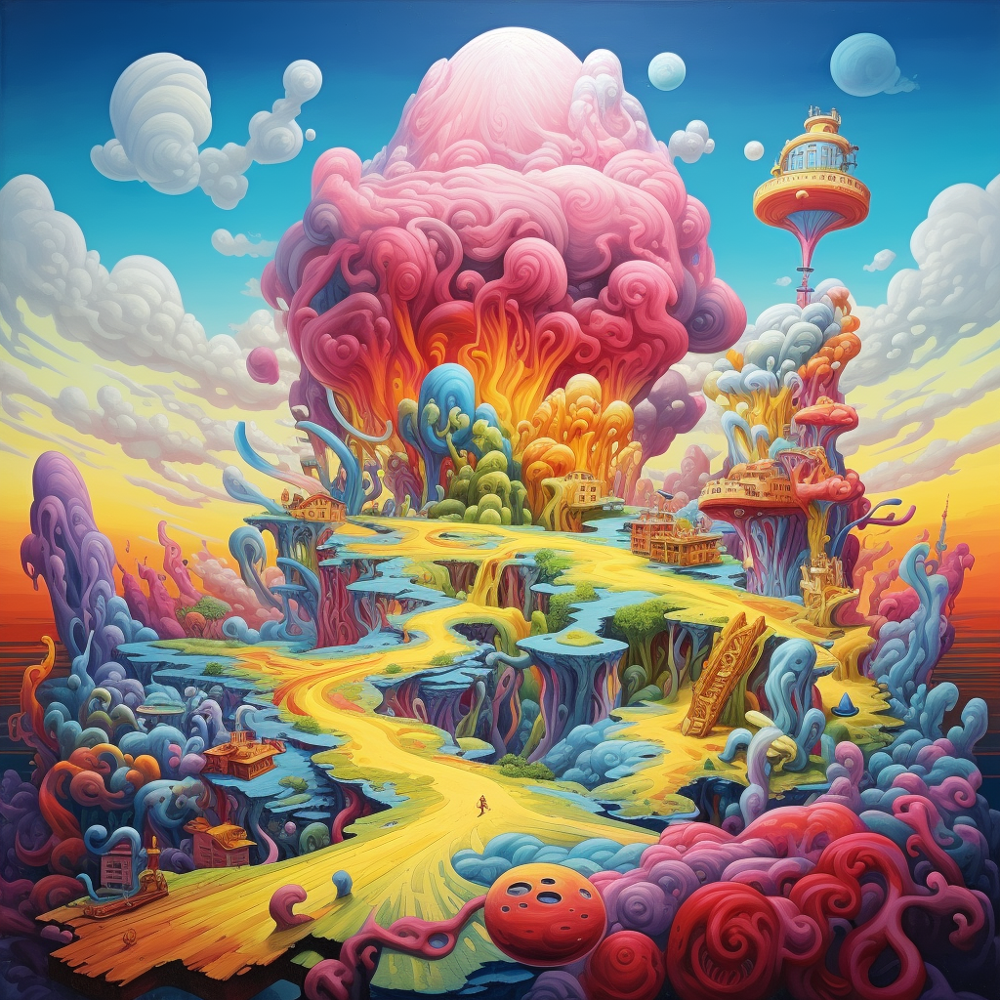

<h1>Image Alias</h1>

Image alias that handles storing and viewing user images.

## Owner(s):
- Me (ShadowsStride)

# Current Plans:
- None

## Help:
`!image [image name] [image url]`

In order to run this properly, you need to do the following:
- Run `!image add [image name] [image url]`, see [add](https://github.com/SethHartman13/Avrae-Aliases-Snippets/blob/master/Aliases/image/add/add.md) subalias for additional information. If you do not, then it will throw an error.

If your are having problems displaying your image, verify that the image url ends in a .png, .jpeg, .jpg, etc.

## Changelog:
6/19/2023 - Alias created

6/19/2023 - Documentation completed

6/19/2023 - Subaliases [add](https://github.com/SethHartman13/Avrae-Aliases-Snippets/blob/master/Aliases/image/add/add.md), [help](https://github.com/SethHartman13/Avrae-Aliases-Snippets/blob/master/Aliases/image/help/help.md), [list](https://github.com/SethHartman13/Avrae-Aliases-Snippets/blob/master/Aliases/image/list/list.md), [remove] (https://github.com/SethHartman13/Avrae-Aliases-Snippets/blob/master/Aliases/image/remove/remove.md), and [update](https://github.com/SethHartman13/Avrae-Aliases-Snippets/blob/master/Aliases/image/update/update.md) have been created. Check the markdown file within the folder marked with their names for additional details.

6/19/2023 - Subalias [restore](https://github.com/SethHartman13/Avrae-Aliases-Snippets/blob/master/Aliases/image/restore/restore.md) has been created. Check the markdown file within the folder marked with their names for additional details.

6/22/2023 - Copyright/License Update

7/4/2023 - Alias rewrite