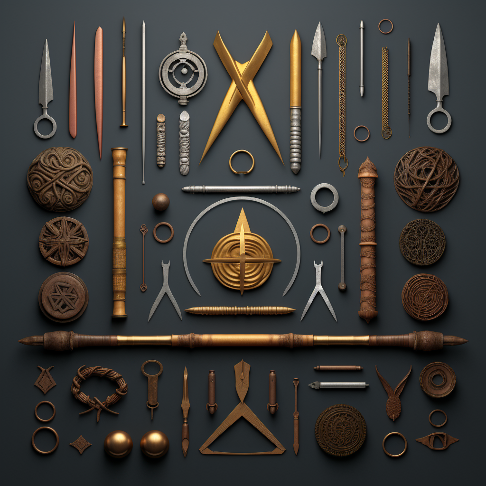

<h1>Clear Subalias</h1>

Subalias that makes it so that you can delete your training CC. This mainly is used when you finish training, but can be used to cancel a training.

## Owner(s):
- Me (ShadowsStride)

## Current Plans:
- None

## Help:
`!train clear`

If you clear your training CC by accident, you can run `!train restore` to undo the clear.